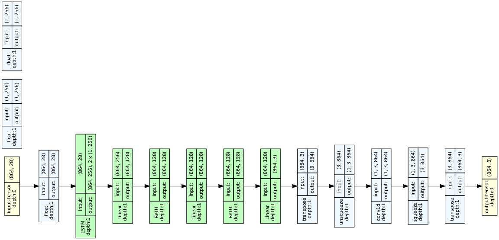
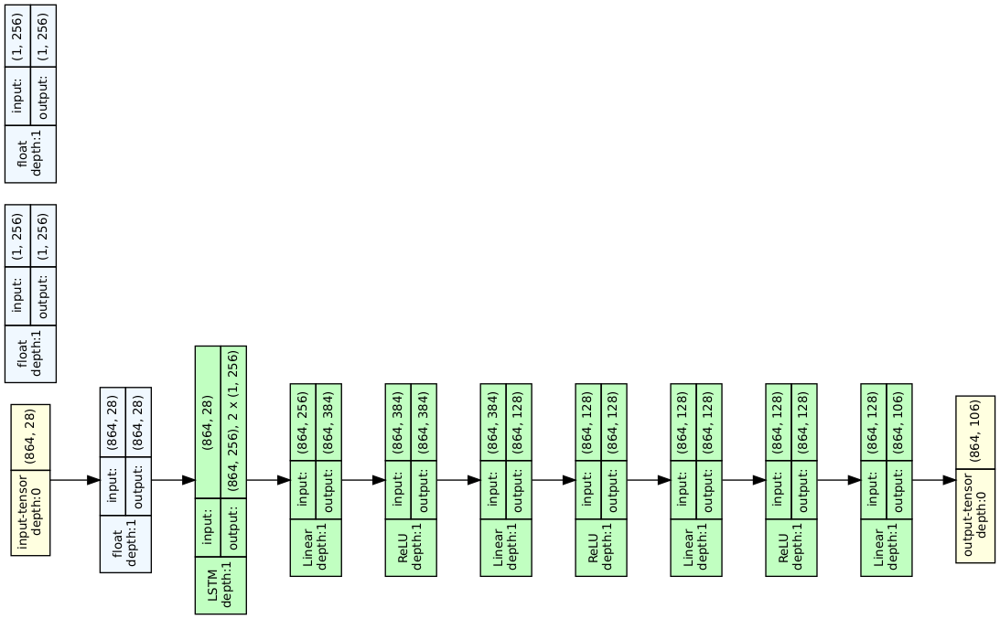

  
  <h1 style="text-align: right;">MSc Thesis</h1>

This is my contribution towards the MSc thesis- 
In this project aims to generate head motion and facial expression 
## Head Motion
the architecture for head motion model is -

    

results-

    

## Facial Expression
the architecture for facial expression model is -

    

results-

    

## Execution
The executable parts are present in the notebook files and the content are self explanatory
