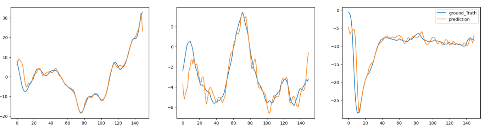
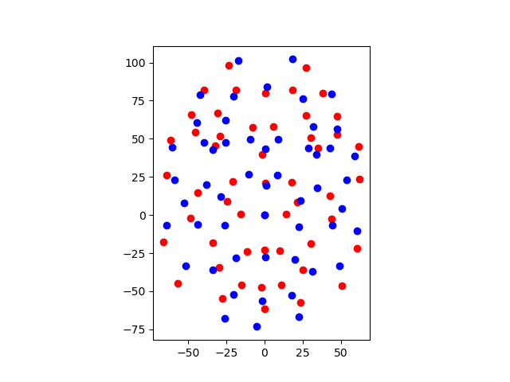

# MSc_Thesis
This is my contribution towards the MSc thesis-
In this project aims to generate head motion and facial expression 
## Head Motion
the architecture for head motion model is -

    

results-

    

## facial expression
the architecture for facial expression model is -

    

results-

    

